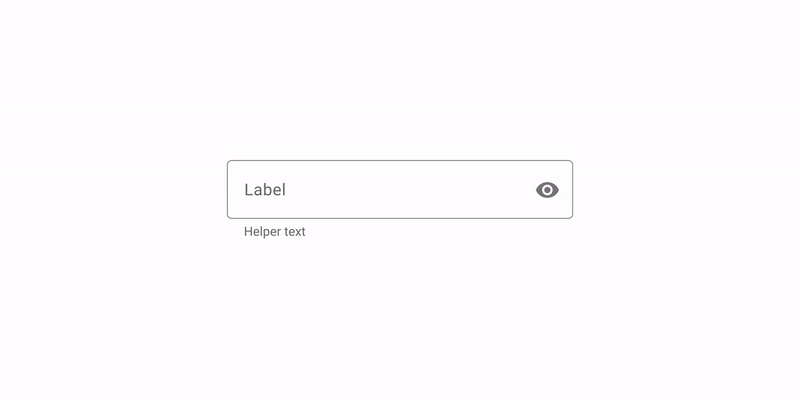
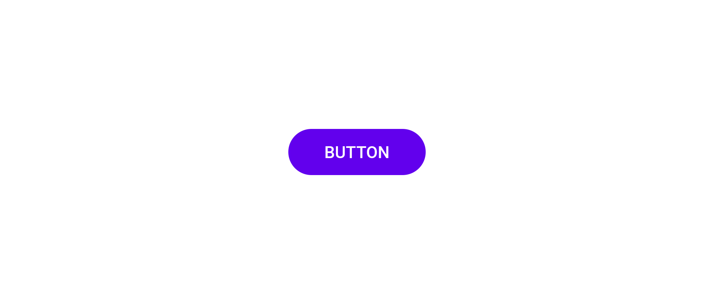

# Tazkrtak Design System

<!-- TOC depthFrom:2 depthTo:3 -->

- [1. Color Palette](#1-color-palette)
- [2. Text Fields](#2-text-fields)
- [3. Buttons](#3-buttons)

<!-- /TOC -->

---

## 1. Color Palette

Use the following colors for [client](https://github.com/tazkrtak/client)

|  Primary   | Primary _[Dark]_ |   Accent   | Grey _[700]_ |
| :--------: | :-----------------: | :--------: | :-------------: |
| ![#32BA7C] |     ![#0AA06E]      | ![#EFCE4A] |   ![#5D5D5D]    |
| `#32BA7C`  |      `#0AA06E`      | `#EFCE4A`  |    `#5D5D5D`    |

[#32ba7c]: https://via.placeholder.com/64/32BA7C/32BA7C
[#0aa06e]: https://via.placeholder.com/64/0AA06E/0AA06E
[#efce4a]: https://via.placeholder.com/64/EFCE4A/EFCE4A
[#5d5d5d]: https://via.placeholder.com/64/5D5D5D/5D5D5D

Use the following colors for [staff](https://github.com/tazkrtak/staff)

|  Primary   | Primary _[Dark]_ |   Accent   | Grey _[100]_ |
| :--------: | :-----------------: | :--------: | :-------------: |
| ![#1089FF] |     ![#23374D]      | ![#424242] |   ![#F5F5F5]    |
| `#1089FF`  |      `#23374D`      | `#424242`  |    `#F5F5F5`    |

[#1089ff]: https://via.placeholder.com/64/1089FF/1089FF
[#23374d]: https://via.placeholder.com/64/23374D/23374D
[#424242]: https://via.placeholder.com/64/424242/424242
[#f5f5f5]: https://via.placeholder.com/64/F5F5F5/F5F5F5

Common colors:

|  Success   |    Info    |  Warning   |   Danger   |
| :--------: | :--------: | :--------: | :--------: |
| ![#28A745] | ![#17A2B8] | ![#FFC107] | ![#DC3545] |
| `#28A745`  | `#17A2B8`  | `#FFC107`  | `#DC3545`  |

[#28a745]: https://via.placeholder.com/64/28A745/28A745
[#17a2b8]: https://via.placeholder.com/64/17A2B8/17A2B8
[#ffc107]: https://via.placeholder.com/64/FFC107/FFC107
[#dc3545]: https://via.placeholder.com/64/DC3545/DC3545

## 2. Text Fields

Use the [outlined text field](https://material.io/components/text-fields/#outlined-text-field) from Google's Material Design.

## 3. Buttons

Use **rounded corners** buttons with an **upper case** label.

